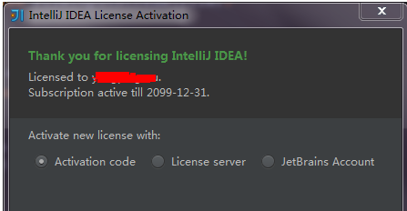

# node.js
日常node-API的学习
## 1.1 WebStorm 的使用：
后边自己将要学习一下有关node的相关的内容，所以我们要用上一个前端编辑的利器--WebStorm。当然了，我们要去官网进行一个下载。.下载完成后，它会提示我们进行一个激活。类似下图

我们选择中间第二个，也就是license server. 并在其中输入http://idea.iteblog.com/key.php 之后就可以直接进入了。当然了，感兴趣的可以在这个下访问到更加全面的破解过程。 
## 1.2 node.js与javascript的异同
  相同点：
  1.基本语法结构一样
  2.基本内置对象 、方法一样
  顶层对象：
  js: window 
  node :global

# node 学习笔记

标签（空格分隔）：node

---

# node.js
日常node-API的学习
## 1.1 WebStorm 的使用：
后边自己将要学习一下有关node的相关的内容，所以我们要用上一个前端编辑的利器--WebStorm。当然了，我们要去进行一个下载。下载完成后，它会提示我们进行一个激活。类似下图
我们选择中间第二个，也就是license.server.并在其中输入:http://idea.iteblog.com/key.php之后就可以直接进入了。当然了，感兴趣的可以在这个下访问到更加全面的破解过程。 
## 1.2 第一个node.js应用
## 1.2 node.js与javascript的异同
  相同点：
  1.基本语法结构一样
  2.基本内置对象 、方法一样
  顶层对象：
  1 javascript: window
  2 node: global

## 1.3 node模块

// var a = 100
// console.log(global.a) // 输出undefined

// 模块
// 我们使用var声明变量时，它不是全局的只是属于当前模块下的。

var a = 100
console.log(a)

global.a = 200

console.log(global.a)

// 当前文件被解析过后的绝对路径
console.log(__filename) //E:\Hello\hello.js 指向当前模块
// 每个模块都有自己的作用域
require("./2.js")
require("2.js") // 将会加载node的核心模块 不建议使用 node_modules
// 模块加载路径 
// 路径：绝对路径 （e:saaa）
//       相对路径：./2.js
